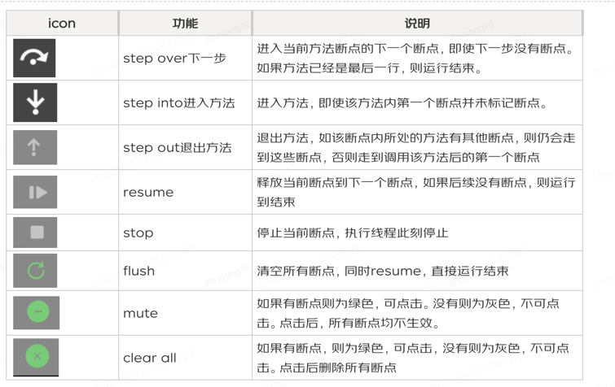

<div align="center">


</div>

##### Translate to: [English](README_en.md)

工作中，你是否：
- 为了查一个小bug而花费一下午。
- 会看见同事为了排查问题在公司彻夜未眠。
- 写的代码看起来明明没问题的，但就是不work，抓狂愤怒。
- 生产出问题，因不能快速定位问题，而导致修复时间被大大拉长，订单损失越来越大。

再分析目前的开发几个痛点：

- 项目依赖的环境复杂，只能在预发进行自测、调试
很多项目因依赖的环境和配置比较复杂，经常没有本地环境可供调试，而开发为了能进行自测、联调、测试，通常是在预发环境上进行。
- 日志的规范考验能力当出现需要调试或者排查问题时，以传统的日志方式诚然也能发现问题，但这比较繁琐，尤其是日志的打印规范非常考验程序员的经验和素质。 当一个项目经过多次交手后，在对老业务进行问题诊断时，称得上两眼一抹黑，无奈也只能加日志、打包、上线、重新请求、查看日志、找出问题，从而浪费生命。
- 传统IDE配置繁琐
传统IDE集成的remote debug能力开启，需要配置开通端口，然后本地服务器启动，再进入调试，比较麻烦，同时本地与服务器代码容易不一致而导致调试混乱。
- 自测、联调、测试期间对于研发的提效困难
  因为很多公司的基础技术底座，从编码到编译、部署、上线都有很成熟的一套方案，但对于自测、联调到测试过程的效率和质量，并没有比较好的工具或者能力。并且在我们长时间的需求迭代中得出结论：研发在迭代需求时需要的开发时间、自测联调、测试时间，这个比例通常是接近1:1:1，如果我们有一个这样的好用的工具，可以把这个时间变成：1:0.7:0.7。
  PS：用该工具，排查bug分钟级，反而是打包、编译部署，更花时间。后期配合hotswap热替换能力快速修复问题，快速支持调试。


## pinkfox 特点

- 良好的界面交互，点击页面代码行添加/取消断点，良好的断点追踪能力。
- 支持基础的debug能力，如step over（下一步）、step into（进入方法）、step out（退出方法）、resume（释放请求）、flush（冲刷）、stop（停止）等。
- 无需本地启动、无需拉取代码，无需IDE环境，直接就能在web端对源码进行断点。
- 支持maven路径树展示。
- 支持一键禁用全部断点、清除全部断点。
- 无需额外开通端口，通过浏览器即可访问和使用。
- 调试代码就是服务器代码，无需担心代码版本不一致问题。
- 编译环节做到预发、线上环境完全隔离，在maven compile阶段加入-Dpinkfox=true即可生效Debug能力。不加-Dpinkfox=true业务完全不受影响（同不加maven dependency）。
- 支持>、<、>=、<=、==等条件表达式断点。
- 支持目标类文件搜索触达。
- 支持内部类断点。
- 支持多线程环境下断点调试。
- 不支持对依赖的第三方Jar内进行断点调试，比如dubbo源码、JDK源码、Spring源码等。
- lambda内断点不支持。
- 在一个类超过2000行时，调试页面性能会下降一点（依赖浏览器渲染性能）。
- 完全自主实现，仅依赖servlet3.0、jackson。


  
## 开始使用（3个步骤）

### 1、添加maven依赖
```xml
<dependency>
    <groupId>co.xiaowangzi</groupId>
    <artifactId>pinkfox</artifactId>
    <version>${version}</version>
</dependency>
```
### 2、在maven compile命令中增加-Dpinkfox=true，例如：
```text
mvn clean -U install -Dmaven.test.skip=true -Dpinkfox=true
```

### 3、访问${ip}/pinkfox.html

## 注意事项
### 1、依赖本包后，本地起服务如果报错：
```text
com.sun.proxy.$Proxy8 cannot be cast to com.sun.tools.javac.processing.JavacProcessingEnvironment
```
解决办法：

打开，例如IDEA的settings–>Build, Execution, deployment–>Compiler，在Shared build process VM opyions中添加：
```text
-Djps.track.ap.dependencies=false
```

### 2、访问pinkfox.html被sso拦截。
请在excludePath中排除/路径，或者进群咨询，群ID在本文最下方。

### 3、jdk支持：
目前只支持java8，tomcat7及以上。
 

### 4、性能损耗
如果生产环境生效了断点能力，虽然在没有设置任何断点的情况下，IO密集型项目性能仍有5%~10%的损耗，CPU密集型性能损耗尤甚，但不影响业务流程的完整性，请自行判断是否给生产环境使用，请看下方最佳实践。
### 5、项目结构问题导致无法使用
因为是web http请求，部分特殊项目结构存在调试页面的servlet请求无法走到debug状态机，从而功能无法正常使用，此时进群咨询，群ID在本文最下方。
### 6、无法获取普通注释
源码展示中javadoc可以正常展示，但普通注释无法输出。
### 7、jdebugger.html访问404
可能被springmvc的DispatchServlet拦截在mvc的配置中加入下面的代码：表示当没有匹配的静态资源交给default servlet处理。

```text
<mvc:default-servlet-handler/>
```

### 8、符号未找到错误（与lombok混用时可能出现此问题）2种解决办法：
将jdebugger的依赖放在lombok之后，如果项目比较复杂，可以按照第二种办法解决
在项目根目录下添加，主动声明annotationProcessor的执行顺序
```xml
<plugin>
  <groupId>org.apache.maven.plugins</groupId>
  <artifactId>maven-compiler-plugin</artifactId>
  <version>3.8.1</version>
  <configuration>
    <source>8</source>
    <target>8</target>
    <encoding>UTF-8</encoding>
    <annotationProcessorPaths>
      <path>
        <groupId>org.projectlombok</groupId>
        <artifactId>lombok</artifactId>
        <version>你的lombok版本</version>
      </path>
      <!-- 这就是文中提到的 jar -->
      <path>
        <groupId>com.jd.java.debug.tools</groupId>
        <artifactId>jdebugger</artifactId>
        <version>2.2-SNAPSHOT</version>
      </path>
    </annotationProcessorPaths>
  </configuration>
</plugin>
```
如果仍然解决不了，加群沟通下。

## 界面使用

### 1、添加/删除断点

点击代码前方小圆点至标记成黄色，则表示打断点成功，代码前方没有圆点，则表示此行代码不支持断点。

### 2、非断点状态
按钮均处于灰色样式，不可点击：


### 3、断点状态
按钮均处于亮色，可点击：


## 4、按钮功能


## 社区
- [微信群]
- [QQ群]

待补充

## 协议
[MIT license](./LICENSE).
